# CMOS XOR Gate Design – Cadence Virtuoso

## Project Overview
This project involves the **schematic design and simulation** of a **2-input CMOS XOR gate** using **Cadence Virtuoso Schematic Editor**. The focus is on analyzing the **DC transfer characteristics** and **transient response** of the circuit under different **transistor widths** and **temperature conditions** using **parametric analysis**.

---

## Tools & Technologies
- **Cadence Virtuoso Schematic Editor**
- **Cadence ADE (Analog Design Environment)**
- CMOS technology (gpdk90 - 90nm)
- Parametric Analysis (Sweep Width, Temperature)

---

## Design Specifications
- **Logic Function**:  Y = A.B + A.B
- **Inputs**: A, B (voltage sources)
- **Output**: Y
- **Technology**: CMOS (Complementary MOSFETs)
- **Simulations**: DC sweep, Transient analysis
- **Parametric Variations**:
  - Transistor widths (Wp/Wn) - (120nm / 120nm) , (240nm / 120nm) , (360nm / 120nm) , (480nm / 120nm) , (600nm / 120nm)
  - Temperature: e.g., -40°C, 27°C, 120°C

- 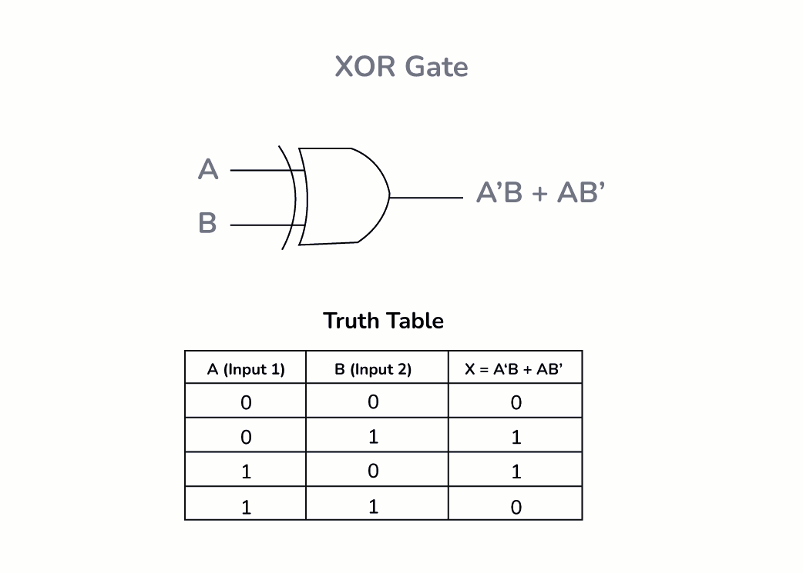
- 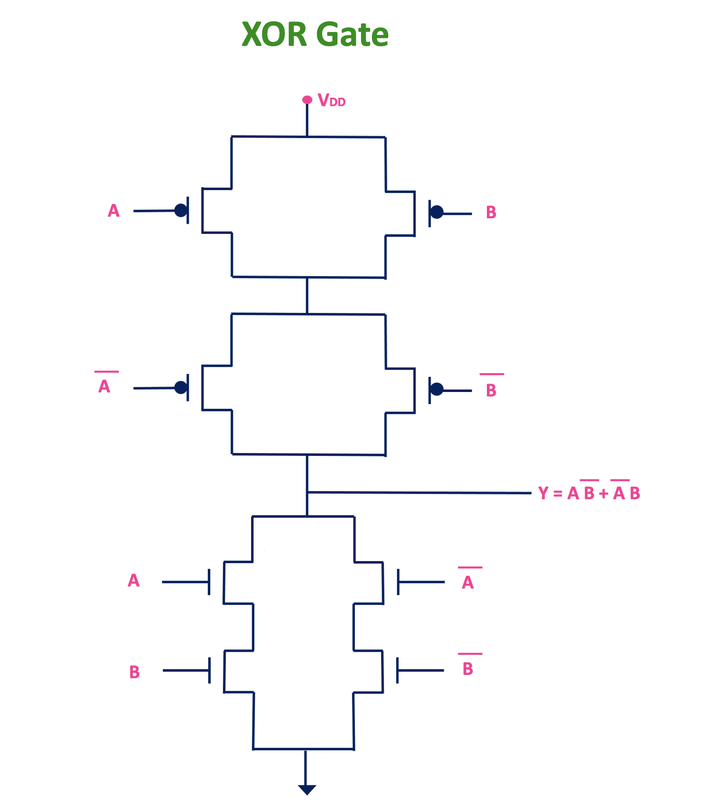
- 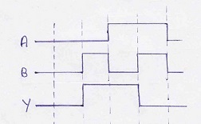

---

## Circuit Schematic

The following schematic shows the CMOS implementation of a 2-input XOR gate using complementary pull-up and pull-down networks:
Figure: CMOS XOR gate schematic drawn in Cadence Virtuoso.
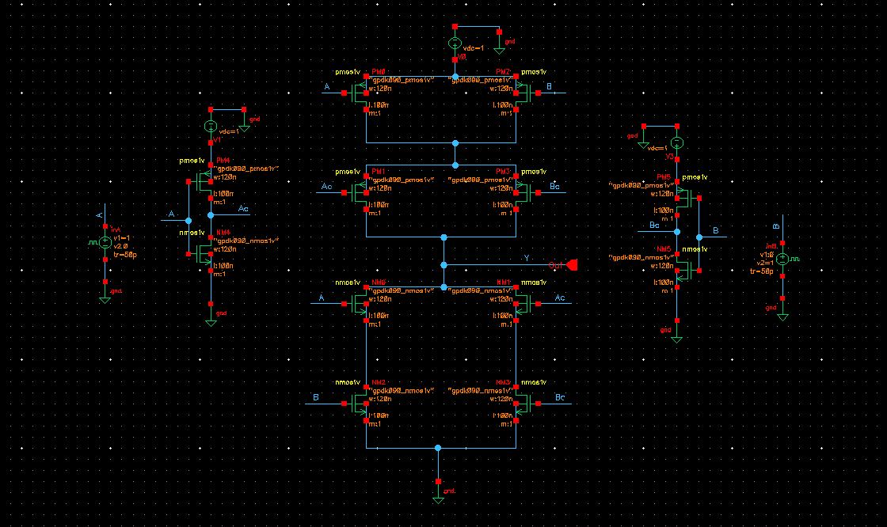

Inputs:
  - A 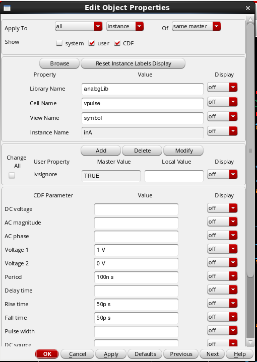
  - B 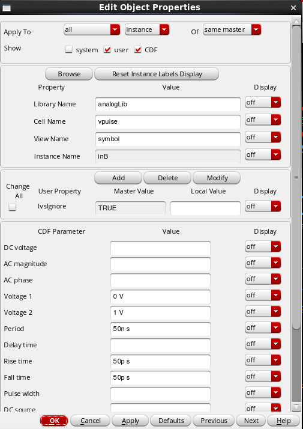

---

##  Simulations Performed

### **DC Transfer Characteristics**

 Setup (ADE L)

-   The DC analysis was configured using Cadence ADE L, with a parametric sweep for:

-   Input voltage: either A or B swept from 0V to VDD
-   Temperature: -40°C, 27°C, 120°C
-   PMOS widths: from 120 nm to 600 nm in steps of 120 nm

-   The simulation aimed to analyze the output voltage behavior of the XOR gate under different scenarios.
-   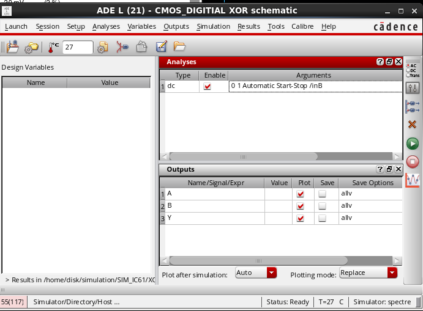

*Sweep on Input A*

-   Input A: swept from 0V to 1V
-   Input B: held constant at 0V
-   This simulates the XOR logic behavior for 0 XOR A
-   The output exhibits expected rising behavior as input A transitions from logic 0 to logic 1
-   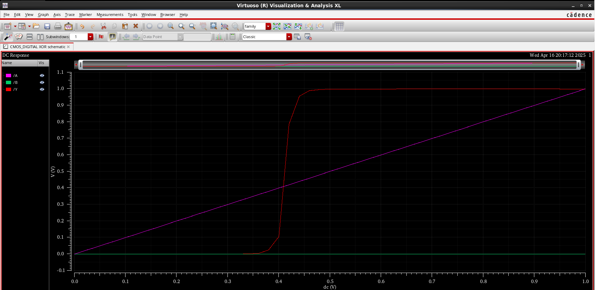

*Sweep on Input B*

-   Input A: held constant at 0V
-   Input B: swept from 0V to 1V
-   This simulates the XOR logic behavior for A XOR 0 (same as above due to symmetry)
-   Output characteristics are similar to the previous case with consistent logic swing
-   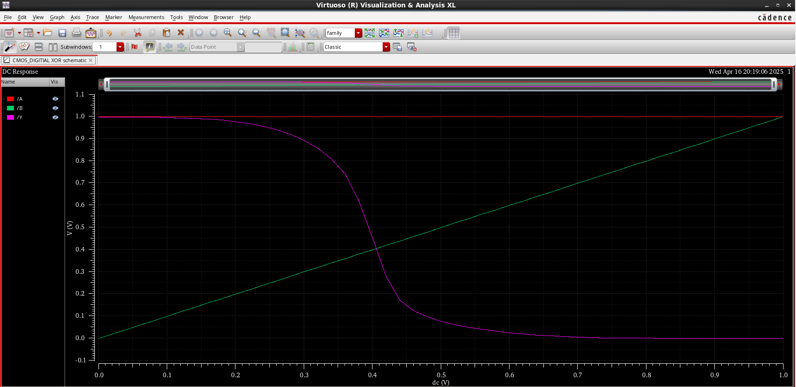

### Transient Analysis

**Setup**

-   **Input Sources**: vpulse sources were used to generate digital transitions for XOR inputs.

-   **A**: 100 ns pulse width, 50 ps rise/fall time
-   **B**: 50 ns pulse width, 50 ps rise/fall time

-   The XOR gate's dynamic behavior was observed through the resulting output waveform.
-   **Simulation Type**: Transient analysis using **Cadence ADE L**\
*Figure: ADE L environment used for transient simulations.* 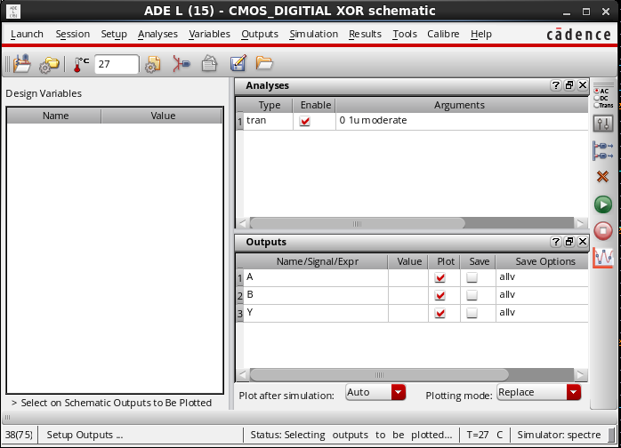

* * * * *

**Parametric Simulation Setup**

-   Parametric sweep configured in ADE L to vary:

-   **PMOS widths**: 120 nm to 600 nm in steps of 120 nm
-   **Temperature**: -40°C, 27°C, and 120°C

-   This setup allows observation of performance variation under different PVT conditions.\
*Figure: Parametric sweep configuration in ADE L.*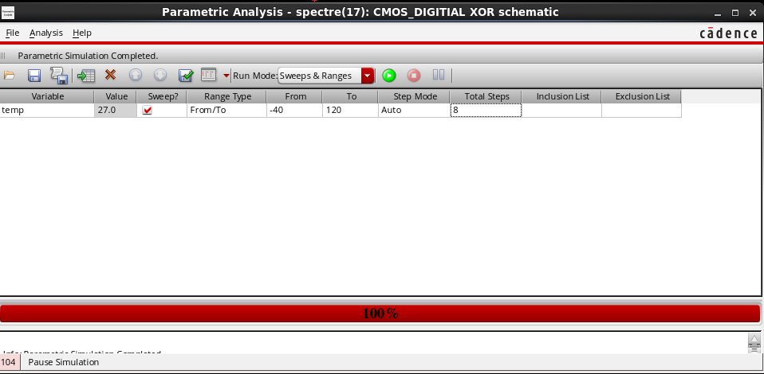

* * * * *

**Transient Response (Baseline)**

-   Output waveform for XOR gate showing expected toggling behavior based on pulse inputs.\
*Figure: XOR gate transient output showing correct logic transitions.* 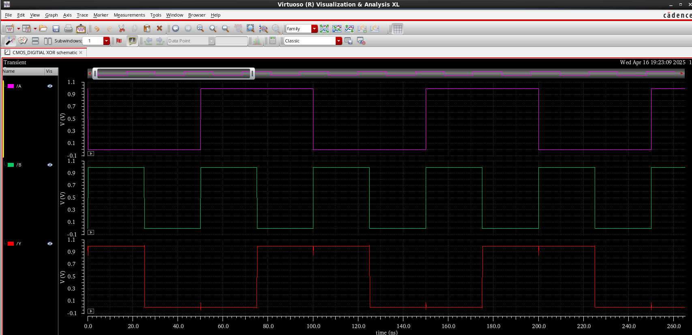

* * * * *

**Effect of PMOS Width Variation**

-   PMOS widths varied from 120 nm to 600 nm.
-   Minor improvement in **rise time** with increased PMOS width; otherwise, output remained consistent.\
*Figure: XOR output response for different PMOS sizes.*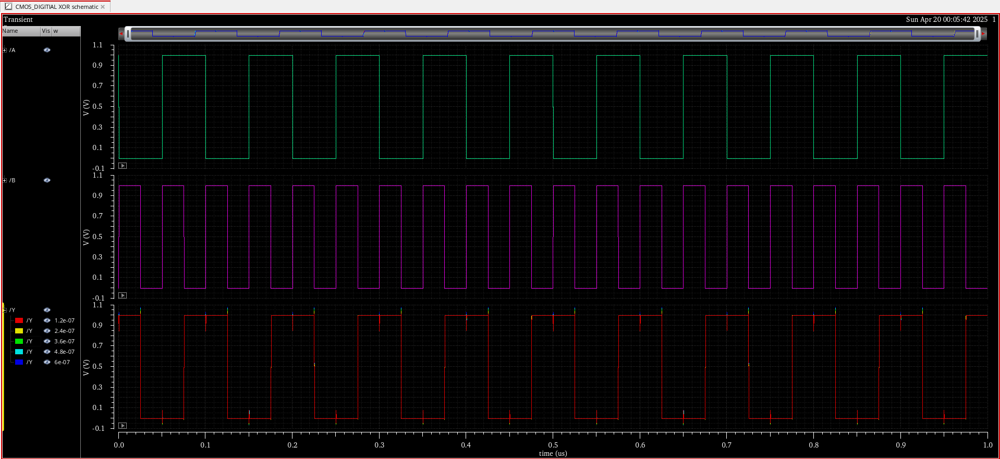

* * * * *

**Effect of Temperature Variation**

-   Temperature swept across -40°C, 27°C, and 120°C.
-   Output waveform shows minimal impact on delay or voltage swing, indicating thermal stability.\
*Figure: XOR transient response across temperature range.* 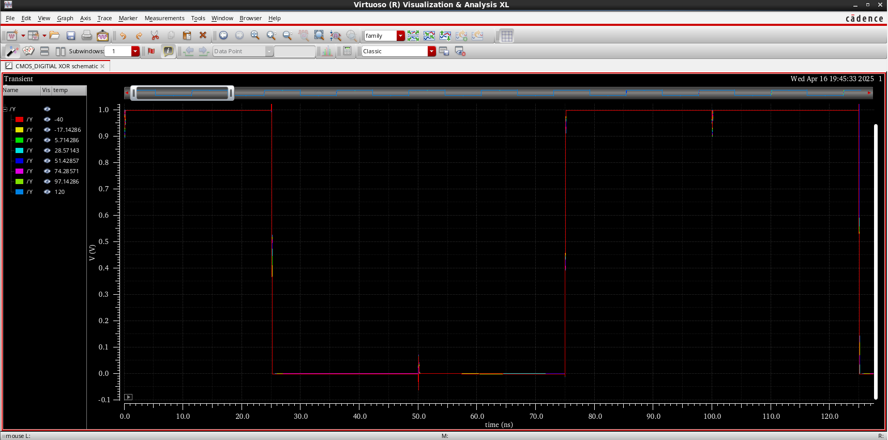

---

## Results and Observations

**1\. Transient Response for Different Temperatures**

**Setup:**

-   CMOS XOR gate simulated using transient analysis in Cadence Virtuoso.
-   Input pulses applied with 1V supply.
-   Temperature varied across **-40°C**, **27°C**, and **120°C**.

**Observation:**

-   The output waveform remained functionally consistent across all three temperature points.
-   **Propagation delay** and **rise/fall times** exhibited **negligible variation**, indicating good temperature stability in the design.
-   No significant degradation in output voltage levels or timing observed.

**Inference:**

-   The CMOS XOR gate demonstrates **temperature robustness** across standard PVT corners. This implies that the performance of the logic circuit is relatively unaffected by temperature within the tested range.

---

**2\. Transient Response for Varying PMOS Widths**

**Setup:**

-   Width of PMOS transistors was swept from **120 nm** to **600 nm** in steps of 120 nm.
-   NMOS width kept constant.
-   Transient simulations run for each sizing configuration.

**Observation:**

-   Output voltage levels and logic functionality remained consistent.
-   Only **minimal changes in rise time** were observed as PMOS width increased.
-   No observable impact on fall time or output amplitude.

**Inference:**

-   Increasing PMOS width in the tested range did not significantly impact XOR gate performance.
-   This suggests that beyond a certain sizing point, further increasing PMOS width offers **diminishing returns**, especially in standard-load digital applications.
-   Sizing optimization should consider area and power trade-offs, as performance gains are minimal.

---

##  How to Run

1. Open Cadence Virtuoso.
2. Load GPDK 90nm library.
3. Open XOR schematic from `schematic/`.
4. Launch ADE and create testbench.
5. Choose analysis type:
   - **DC Analysis** (sweep input)
   - **Transient Analysis** (using `vpulse`)
6. Use **Tools > Parametric Analysis** for:
   - Varying transistor widths
   - Temperature sweep
7. Run and observe waveforms.

---

## Author
**Pratyush**  
BTech in Electronics (VLSI)  
Punjab Engineering College, Chandigarh  
[LinkedIn](https://www.linkedin.com/in/pratyush-kumar-076751289/) | [GitHub](https://github.com/pratstick)

---

## Acknowledgements

This project was made possible through the support, tools, and guidance provided by various individuals and institutions. I would like to express my sincere gratitude to:

-   **Cadence Design Systems**, for providing the industry-standard tools used for schematic design and simulation.
-   **Punjab Engineering College ,Chandigarh**, for the academic environment and resources that supported this work.
-   **Ashmit Garg**, VLSI, Punjab Engineering College ,Chandigarh 
-   **Shashwat Mishra**, VLSI, Punjab Engineering College ,Chandigarh
-   **Department of Electronics and Communication Engineering**, PEC - for enabling access to simulation tools and lab resources.

---

 ##  References
 
- CMOS Digital Integrated Circuits - Analysis and Design, S. Kang and Y. Leblebici, Tata McGraw Hill 3rd ed. 
- CMOS Digital VLSI Design By Prof. Sudeb Dasgupta, IIT Roorkee (https://archive.nptel.ac.in/noc/courses/noc21/SEM1/noc21-ee09/)
- [Virtuoso Guide | Cadence](https://docs.virtuoso.qa/guide/)
- [gpdk90 docs | Princeton](https://www.princeton.edu/~nverma/cadenceSetup_6.1.7/gpdk090_v4.4/docs/gpdk090_spec.pdf)

---
